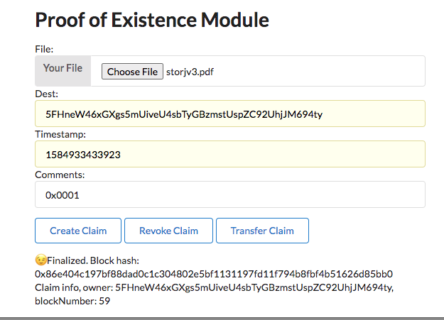
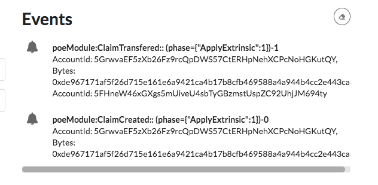

## 第四课作业

试在 [Substrate Front-end Template](https://github.com/SubstrateCourse/substrate-front-end-template) 或 node.js (node.js 则以命令行介面)，实现以下功能：

这一题是基于第三节课的第二题。之前 后端 有一个 map 从 文件的 hash 关联到 用户 AccountID。然在也要记录创建的时间，还有就是前端加个 text input 允许用户存证时输入一组不长于 256 字符串的备注。

答案：

